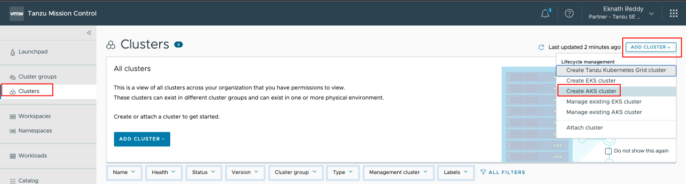
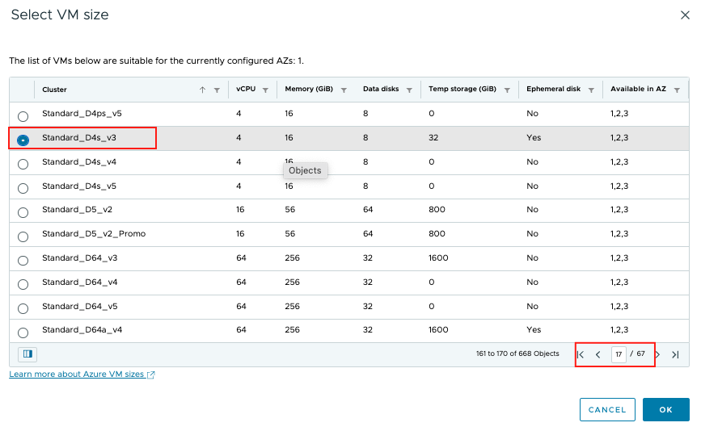
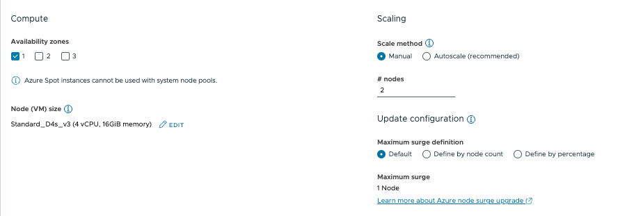
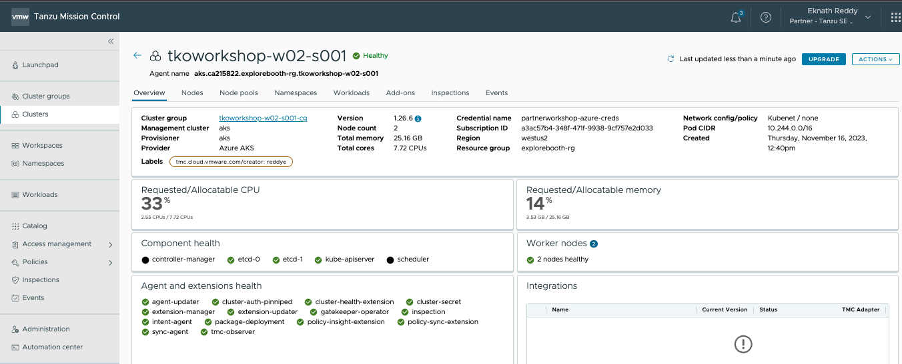

<p style="color:blue"><strong> Click here to test the execution in terminal</strong></p>

```execute-1
echo "Hello, Welcome to Partner workshop session"
```

<p style="color:blue"><strong> Click here to check the Tanzu version</strong></p>

```execute
tanzu version
```

<p style="color:blue"><strong> Click here to check the AZ version</strong></p>

```execute
az --version
```

<p style="color:blue"><strong> Click here to check the kubectl version</strong></p>

```execute
kubectl version
```

<p style="color:blue"><strong> Set environment variable </strong></p>

```execute-all
export SESSION_NAME={{ session_namespace }}
```

###### Check below repo to view the workload content which will ba used while created a workload: 

```dashboard:open-url
url: https://gitea-tapdemo.tap.tanzupartnerdemo.com/tapdemo-user/tanzu-java-web-app
```

###### Create an AKS Cluster from TMC Console

```dashboard:open-url
url: https://partnertanzuseamericas.tmc.cloud.vmware.com/
```

In TMC Console as shown in below screenshot, Click on **Clusters** > **Add Cluster** > **Create AKS cluster**

  

###### Provide below details:

* Cluster name: **{{ session_namespace }}-tap**
* Cluster group: **{{ session_namespace }}-cg** and click **Next**
* Account credential: **Leave to default**, if nothing shown then select: **partnerworkshop-azure-creds**
* Subscription: **Leave to default**
* Resource group: **partnerworkshop-India** , Leave other options as default and click **Next**
* Cluster Details: Select Kubernetes version as **1.26.6**
* Select the Nodepool Compute as below:

  * Availability Zones: **1**
  * Edit the Node size and select **Standard_D4s_V3**
  * Scale Method: **Manual** and nodes to **4**
  * Click **Next** and **Create**
   
    

    

**Note:** Wait for the cluster creation to complete, should take around 5-10 mins. 

 

###### Connect to AKS Cluster 

```execute-1
tanzu mission-control aks-cluster list
```

* Check the cluster **aks.ca215822.partnerworkshop-india.{{ session_namespace }}-tap** is created and **Ready**

<p style="color:blue"><strong> Download the kube config file of the created cluster from TMC Console </strong></p>

```execute-1
tanzu mission-control cluster kubeconfig get aks.ca215822.partnerworkshop-india.{{ session_namespace }}-tap -p aks -m aks > kubeconfig.yml
```

<p style="color:blue"><strong> Verify the cluster access </strong></p>

```execute-1
kubectl get ns --kubeconfig=kubeconfig.yml 
```

```execute-1
cp kubeconfig.yml ~/.kube/config 
```

<p style="color:blue"><strong> Check if the current context is set to "{{ session_namespace }}-tap" </strong></p>

```execute-1
kubectl config get-contexts
```


<p style="color:blue"><strong> List the nodes </strong></p>

```execute-1
kubectl get nodes
```

<p style="color:blue"><strong> Set the variable </strong></p>

```execute
export DOCKER_REGISTRY_PASSWORD=D8p25yfQXLwA1yfh0vl319OOLjRUk4Hfa44NiCepCZ+ACRBgLRZ5
```
  
<p style="color:blue"><strong> Docker login to image repo </strong></p>

```execute
docker login tapworkshopoperators.azurecr.io -u tapworkshopoperators -p $DOCKER_REGISTRY_PASSWORD
```

<p style="color:blue"><strong> Create namespaces </strong></p>

```execute
kubectl create ns tap-install
```

```execute
kubectl create ns tap-workload
```

<p style="color:blue"><strong> Set environment variable </strong></p>


```execute
export INSTALL_BUNDLE=registry.tanzu.vmware.com/tanzu-cluster-essentials/cluster-essentials-bundle@sha256:ca8584ff2ad4a4cf7a376b72e84fd9ad84ac6f38305767cdfb12309581b521f5
export INSTALL_REGISTRY_HOSTNAME=registry.tanzu.vmware.com
```

<p style="color:blue"><strong> Env variable </strong></p>

```execute
export INSTALL_REGISTRY_USERNAME=eknath.reddy09@gmail.com
```

<p style="color:blue"><strong> Env variable </strong></p>

```execute
export INSTALL_REGISTRY_PASSWORD=Newstart@1
```

```execute
cd $HOME/tanzu-cluster-essentials
```

<p style="color:blue"><strong> Install cluster essentials in **{{ session_namespace }}-tap**  </strong></p>

```execute
./install.sh -y
```


<p style="color:blue"><strong> Create tap-registry secret </strong></p>

```execute
sudo tanzu secret registry add tap-registry --username tapworkshopoperators --password $DOCKER_REGISTRY_PASSWORD --server tapworkshopoperators.azurecr.io --export-to-all-namespaces --yes --namespace tap-install
```


```execute
sudo tanzu secret registry add registry-credentials --username tapworkshopoperators --password $DOCKER_REGISTRY_PASSWORD --server tapworkshopoperators.azurecr.io --export-to-all-namespaces --yes --namespace tap-workload
```

<p style="color:blue"><strong> Verify the pods in kapp-controller namespace  and secretgen-controller </strong></p>

```execute
kubectl get pods -n kapp-controller
```

```execute
kubectl get pods -n secretgen-controller
```

<p style="color:blue"><strong> Changes to tap values file" </strong></p>

```execute
sed -i -r "s/password-registry/$DOCKER_REGISTRY_PASSWORD/g" $HOME/tap-values.yaml
```

```execute
sed -i -r "s/SESSION_NAME/$SESSION_NAME/g" $HOME/tap-values.yaml
```

```execute
sed -i -r "s/SESSION_NAME/$SESSION_NAME/g" $HOME/tas-adapter-values.yaml
```

<p style="color:blue"><strong> You can also deploy **Tanzu Application Platform** directly from Tanzu Mission Control Console, Check the below documentation for detailed steps </strong></p>

```dashboard:open-url
url: https://docs.vmware.com/en/VMware-Tanzu-Mission-Control/services/tanzumc-using/GUID-1BA391EC-A49B-44AE-A8C7-D72F6012EF58.html
```

*Note*: In this workshop, You will be deploying **Tanzu Application Platform** through Tanzu CLI. 
