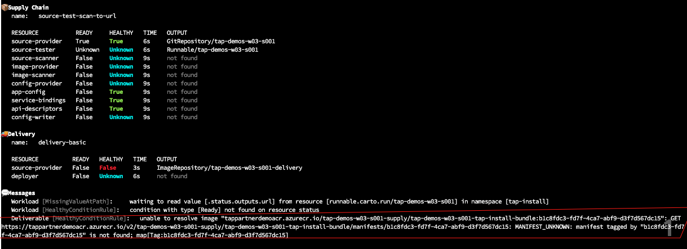
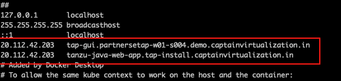
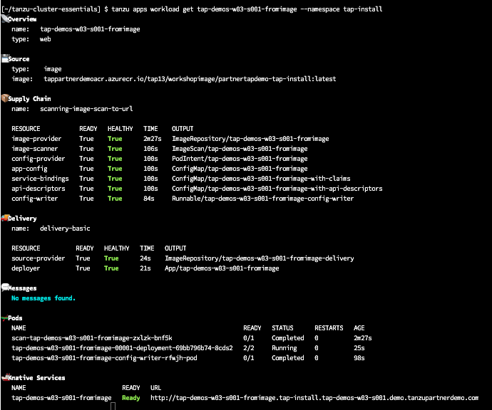
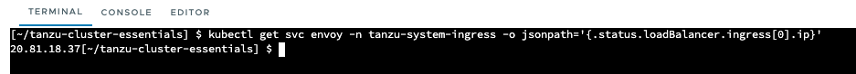
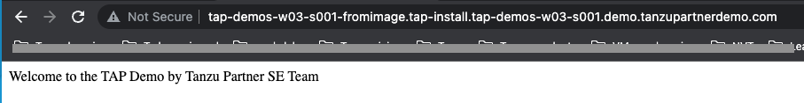

<p style="color:blue"><strong> Review below yaml files </strong></p>

```execute
cat $HOME/developer.yaml
```

```execute
cat $HOME/tekton-pipeline.yaml
```

```execute
cat $HOME/scanpolicy.yaml
```

<p style="color:blue"><strong> Setup developer namespace </strong></p>

```execute
kubectl apply -f $HOME/developer.yaml -n tap-workload
```

<p style="color:blue"><strong> Deploy Secret overlay for source scanning </strong></p>

```execute
kubectl apply -f $HOME/secret-overlay.yaml
```

###### Remove (#) from lines 3 - 6 of tap-values.yaml

```editor:open-file
file: /home/eduk8s/tap-values.yaml
```

###### Refresh the packages with updated tap-values file

```execute
sudo tanzu package installed update tap --values-file $HOME/tap-values.yaml -n tap-install
```

<p style="color:blue"><strong> Deploy Tekton pipeline </strong></p>

```execute
kubectl apply -f $HOME/tekton-pipeline.yaml -n tap-workload
```

<p style="color:blue"><strong> Deploy Scanpolicy </strong></p>

```execute
kubectl apply -f $HOME/scanpolicy.yaml -n tap-workload
```

```execute
kubectl apply -f $HOME/secret-git.yaml -n tap-workload
```

###### Now its time to deploy an application on TAP. Provide the gitrepo that you have forked in the beginning. 

```execute
sudo tanzu apps workload create {{ session_namespace }}  --git-repo https://gitea-tapdemo.tap.tanzupartnerdemo.com/tapdemo-user/partnertapdemo --git-branch main --type web --label apps.tanzu.vmware.com/has-tests=true --label app.kubernetes.io/part-of=partnertapdemo -n tap-workload --yes
```

<p style="color:blue"><strong> Get the status of deployed application </strong></p>

```execute
sudo tanzu apps workload get {{ session_namespace }} -n tap-workload
```

*Note:* Ignore below error, it is expected. 



<p style="color:blue"><strong> Check the live progress of application</strong></p>

```execute-2
sudo tanzu apps workload tail {{ session_namespace }} --since 10m --timestamp -n tap-workload
```

<p style="color:blue"><strong> Check all the installed applications </strong></p>

```execute
sudo tanzu apps workload list -n tap-workload
```

<p style="color:blue"><strong> Get the pods in tap-workload namespace </strong></p>

```execute
kubectl get pods -n tap-workload
```

###### Note: Workload creation takes 5 mins to complete, proceed further once you see ready status

```execute
sudo tanzu apps workload get {{ session_namespace }} -n tap-workload
```


###### Apply Annotation

```execute
tanzu apps workload apply {{ session_namespace }} --annotation autoscaling.knative.dev/minScale=1 -n tap-workload -y
```

```terminal:interrupt
session: 2
```

<p style="color:blue"><strong> Collect the load balancer IP </strong></p>

```execute
kubectl get svc envoy -n tanzu-system-ingress -o jsonpath='{.status.loadBalancer.ingress[0].ip}'
```

###### Add an entry in local host /etc/hosts path pointing the above collected load balancer IP with {{ session_namespace }}.tap-workload.{{ session_namespace }}.demo.tanzupartnerdemo.com



<p style="color:blue"><strong> Access the deployed application </strong></p>

```dashboard:open-url
url: http://{{ session_namespace }}.tap-workload.{{ session_namespace }}.demo.tanzupartnerdemo.com
```


### Pre-build image: 

```dashboard:open-url
url: https://docs.vmware.com/en/VMware-Tanzu-Application-Platform/1.7/tap/scc-pre-built-image.html
```

```execute
sudo tanzu apps workload list -n tap-workload
```

Note: Image is already created for this workshop and uploaded to ACR. 

```execute
tanzu apps workload create {{ session_namespace }}-fromimage --image tapworkshopoperators.azurecr.io/tap13/workshopimage/partnertapdemo-tap-install:latest --type web --app {{ session_namespace }}-fromimage -n tap-workload -y
```

```execute
sudo tanzu apps workload get {{ session_namespace }}-fromimage -n tap-workload
```

```execute-2
tanzu apps workload tail {{ session_namespace }}-fromimage --namespace tap-workload
```




<p style="color:blue"><strong> Collect the load balancer IP </strong></p>

```execute
kubectl get svc envoy -n tanzu-system-ingress -o jsonpath='{.status.loadBalancer.ingress[0].ip}'
```



###### Add an entry in local host /etc/hosts path pointing the above collected load balancer IP with {{ session_namespace }}-fromimage.tap-workload.{{ session_namespace }}.demo.tanzupartnerdemo.com


<p style="color:blue"><strong> Access the deployed application </strong></p>

```dashboard:open-url
url: http://{{ session_namespace }}-fromimage.tap-workload.{{ session_namespace }}.demo.tanzupartnerdemo.com
```



```terminal:interrupt
session: 2
```
