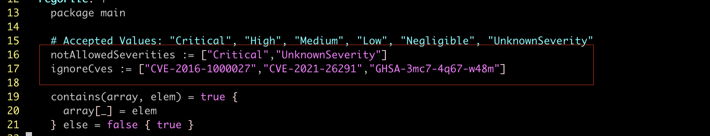
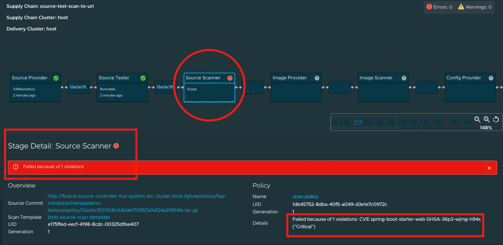
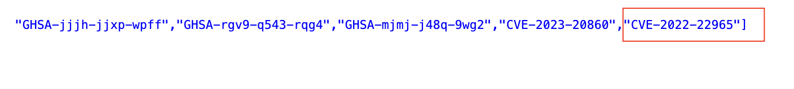
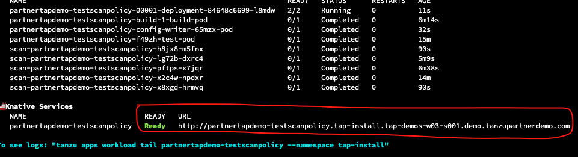
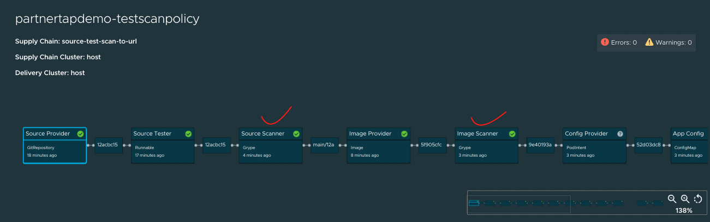
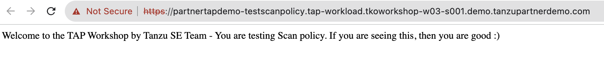

In this section, lets make some changes to the scanpolicy file and see how the application deployment goes through, how the errors can be fixed. 

```execute
sudo tanzu apps workload list -n tap-workload
```

Edit scanpolicy and Add "Critical" to notAllowedSeverities list: 

```editor:open-file
file: /home/eduk8s/scanpolicy.yaml
line: 20
```

ref Image: 

```execute
kubectl apply -f $HOME/scanpolicy.yaml -n tap-workload
```

```execute
sudo tanzu apps workload create partnertapdemo-testscanpolicy  --git-repo https://github.com/Eknathreddy09/partnertapdemo-app --git-branch main --type web --label apps.tanzu.vmware.com/has-tests=true --label app.kubernetes.io/part-of=partnertapdemo -n tap-workload --yes
```

```execute
tanzu apps workload apply partnertapdemo-testscanpolicy --annotation autoscaling.knative.dev/minScale=1 -n tap-workload -y
```

```execute
sudo tanzu apps workload get partnertapdemo-testscanpolicy -n tap-workload
```

```execute-2
sudo tanzu apps workload tail partnertapdemo-testscanpolicy -n tap-workload
```

```dashboard:open-url
url: http://tap-gui.{{ session_namespace }}.demo.tanzupartnerdemo.com/supply-chain/host/tap-workload/partnertapdemo-testscanpolicy
```

After few mins, you notice the workload deployment do not progress and few errors can be under workload supply chain in TAP GUI as shown below: 

ref Image: 

```editor:open-file
file: /home/eduk8s/scanpolicy.yaml
line: 21
```

Add the CVE **CVE-2022-22965** to ignoreCves list as shown in below image: 

ref Image: 

```execute
kubectl apply -f $HOME/scanpolicy.yaml -n tap-workload
```

Soon after the scanpolicy is updated, you can see the deployment progressing in **Terminal-2**. 

```execute
sudo tanzu apps workload get partnertapdemo-testscanpolicy -n tap-workload
```

```dashboard:open-url
url: http://tap-gui.{{ session_namespace }}.demo.tanzupartnerdemo.com/supply-chain/host/tap-workload/partnertapdemo-testscanpolicy
```

ref Image: 

###### Verify in TAP GUI Supply chain status: 

```dashboard:open-url
url: http://tap-gui.{{ session_namespace }}.demo.tanzupartnerdemo.com/supply-chain/host/tap-workload/partnertapdemo-testscanpolicy
```

ref Image: 

```execute
kubectl get svc envoy -n tanzu-system-ingress -o jsonpath='{.status.loadBalancer.ingress[0].ip}'
```

```terminal:interrupt
session: 2
```

Add an entry in local host /etc/hosts path pointing the above collected *load balancer IP* with **partnertapdemo-testscanpolicy.tap-workload.{{ session_namespace }}.demo.tanzupartnerdemo.com**

ref Image: 

```dashboard:open-url
url: http://partnertapdemo-testscanpolicy.tap-workload.{{ session_namespace }}.demo.tanzupartnerdemo.com
```

ref Image: 
