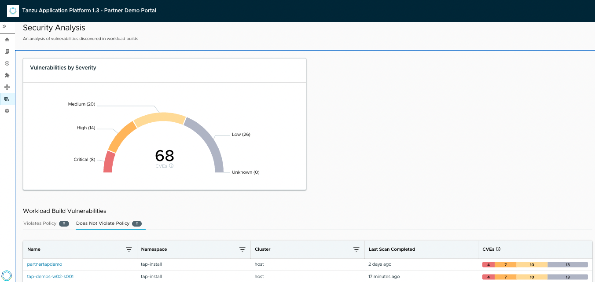
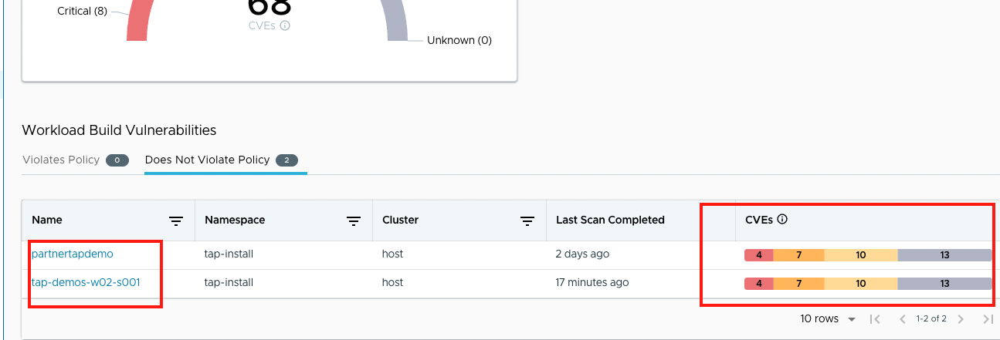
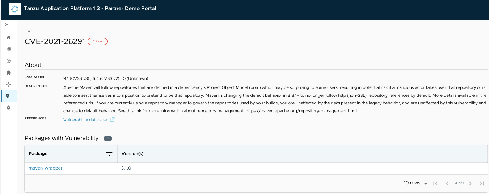
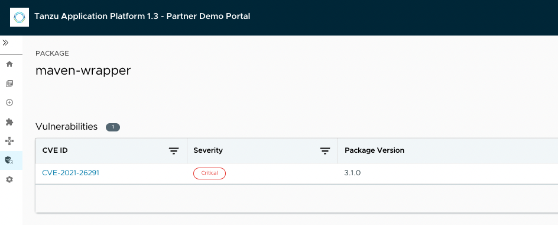

The Security Analysis plug-in summarizes vulnerability data across all workloads running in Tanzu Application Platform, enabling faster identification and remediation of CVEs.

The Security Analysis plug-in is part of the Tanzu Application Platform Full and View profiles.

The Security Analysis plug-in is always accessible from the left navigation panel. Click the Security Analysis button to open the Security Analysis dashboard.

```dashboard:open-url
url: https://tap-gui.{{ session_namespace }}.demo.tanzupartnerdemo.com/security-analysis
```



Viewing vulnerability data
The Security Analysis dashboard provides a summary of all vulnerabilities across all clusters for single-cluster and multi-cluster deployments.

The Vulnerabilities by Severity widget quickly counts the number of critical, high, medium, low, and unknown severity CVEs, based on the CVSS severity rating of each CVE.

It includes a sum of all workloads’ source and image scan vulnerabilities. For example, if CVE-123 exists in Workload ABC’s and Workload DEF’s latest source scans and image scans, it is counted four times.

Note: The sum includes any CVEs on the allowlist (ignoreCVEs).

Viewing CVE and package details
The Security Analysis plug-in has a CVE page and a Package page. These are accessed by clicking on a workload name, which opens the Supply Chain Choregrapher plug-in. Clicking on the CVE or Package name opens the CVE or Package page, respectively.



Click on deployed app {{ session_namespace }} by navigating to url

```dashboard:open-url
url: https://tap-gui.workshop.tap.tanzupartnerdemo.com/supply-chain/host/tap-workload/{{ session_namespace }}/source-scanner
```






