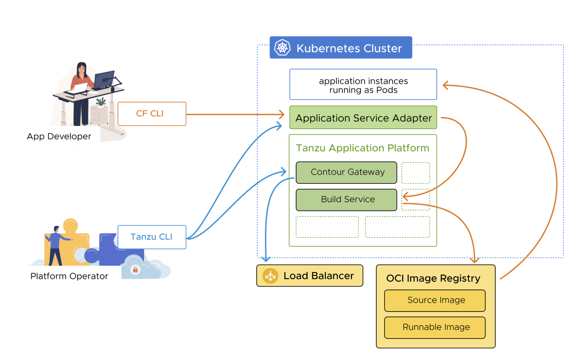
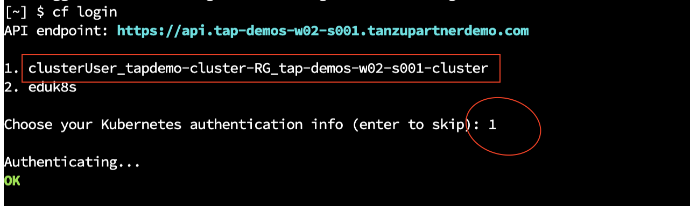
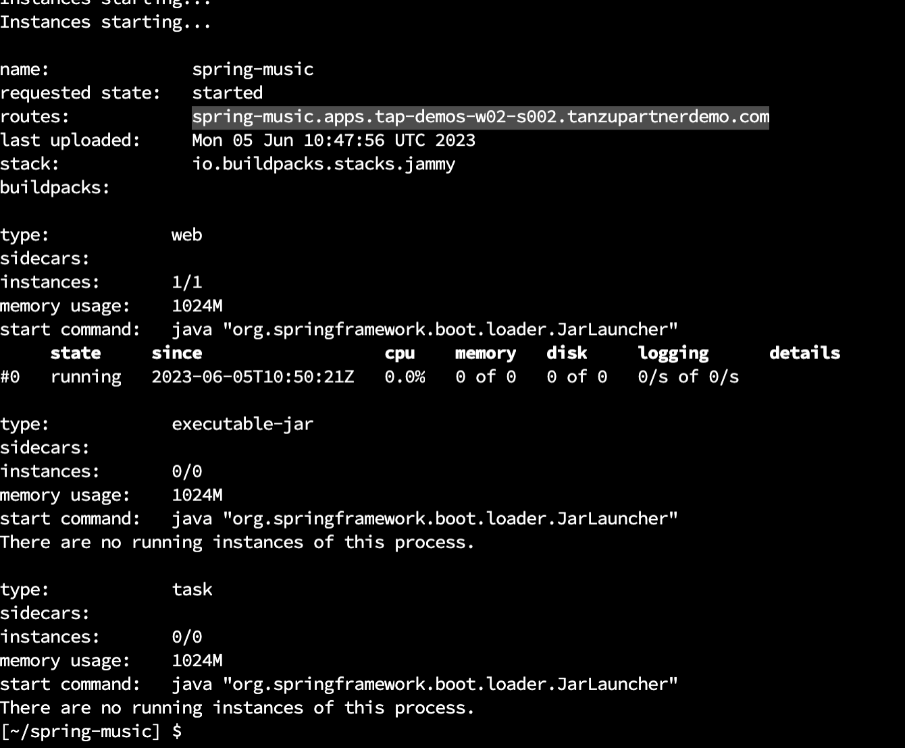
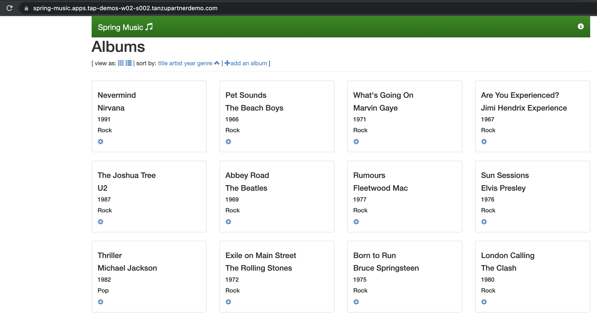

Application Service Adapter provides compatibility with CF client interfaces while running on top of K8s and integrating with Tanzu Application Platform. 

With Application Service Adapter, development teams using Tanzu Application Service for VMs tooling, such as the Cloud Foundry command-line interface (cf CLI) and other clients of the Cloud Foundry API (CAPI), can maintain their familiar workflows while their platform teams transition their infrastructure and deployments to Kubernetes.



```dashboard:open-url
url: https://docs.vmware.com/en/Application-Service-Adapter-for-VMware-Tanzu-Application-Platform/1.2/tas-adapter/install-prerequisites.html
```

<p style="color:blue"><strong> Verify CF cli version </strong></p>

```execute-1
cf version
```

<p style="color:blue"><strong> Set up environment variables for the installation </strong></p>

```execute-1
export TAS_ADAPTER_VERSION=1.2.0
```

<p style="color:blue"><strong> Verify that the tap-install namespace exists in your cluster </strong></p>

```execute-1
kubectl get ns tap-install
```

<p style="color:blue"><strong> Create a registry secret to store your VMware Tanzu Network credentials in the tap-install namespace </strong></p>

```execute-1
sudo tanzu secret registry add tanzunet-tas-adapter-registry --username "eknath.reddy09@gmail.com"  --password "Newstart@1"  --server registry.tanzu.vmware.com --export-to-all-namespaces --yes  --namespace tap-install
```
<p style="color:blue"><strong> Add the Application Service Adapter package repository to the cluster </strong></p>

```execute-1
tanzu package repository add tas-adapter-repository --url registry.tanzu.vmware.com/app-service-adapter/tas-adapter-package-repo:${TAS_ADAPTER_VERSION} --namespace tap-install
```
<p style="color:blue"><strong> Verify that the package repository contains the Application Service Adapter package. </strong></p>

```execute-1
tanzu package available list --namespace tap-install
```

<p style="color:blue"><strong> create namespace for API TLS SECRET </strong></p>

```execute-1
kubectl create namespace cf-adapter
```
<p style="color:blue"><strong> create namespace for APPS TLS SECRET </strong></p>

```execute-1
kubectl create namespace apps-cf-adapter
```

<p style="color:blue"><strong> create namespace for APP Registry </strong></p>

```execute-1
kubectl create namespace cf-app-registry
```

<p style="color:blue"><strong> Create secret for API  </strong></p>

```execute-1
kubectl create secret tls cf-api-secret --cert=$HOME/certs/live/api.{{ session_namespace }}.tanzupartnerdemo.com/fullchain.pem --key=$HOME/certs/live/api.{{ session_namespace }}.tanzupartnerdemo.com/privkey.pem  --namespace cf-adapter
```

<p style="color:blue"><strong> Create secret for APPS  </strong></p>

```execute-1
kubectl create secret tls cf-apps-secret --cert=$HOME/certs/live/apps.{{ session_namespace }}.tanzupartnerdemo.com/fullchain.pem --key=$HOME/certs/live/apps.{{ session_namespace }}.tanzupartnerdemo.com/privkey.pem  --namespace apps-cf-adapter
```

<p style="color:blue"><strong> Create secret for App Registry  </strong></p>

```execute-1
kubectl create secret docker-registry cf-app-registry-cred --docker-server=tapworkshopoperators.azurecr.io --docker-username=tapworkshopoperators --docker-password=$DOCKER_REGISTRY_PASSWORD --namespace=cf-app-registry
```

```execute-1
kubectl apply -f - <<EOF
---
apiVersion: secretgen.carvel.dev/v1alpha1
kind: SecretExport
metadata:
  name: cf-app-registry-cred
  namespace: cf-app-registry
spec:
  toNamespace: "*"
EOF
```

<p style="color:blue"><strong> Install Application Service Adapter to the cluster </strong></p>

```execute-1
cat $HOME/tas-adapter-values.yaml
```

<p style="color:blue"><strong> Install Application Service Adapter to the cluster </strong></p>

```execute-1
tanzu package install tas-adapter --package application-service-adapter.tanzu.vmware.com --version "${TAS_ADAPTER_VERSION}" --values-file $HOME/tas-adapter-values.yaml --namespace tap-install
```

<p style="color:blue"><strong> Verify that the package install was successful </strong></p>

```execute-1
tanzu package installed get tas-adapter --namespace tap-install
```

<p style="color:blue"><strong> Get the Ingress IP and update the same to instructor to add in DNS </strong></p>

```execute-1
kubectl -n tanzu-system-ingress get service envoy -ojsonpath='{.status.loadBalancer.ingress[*].ip}'
```

<p style="color:blue"><strong> erify that the Contour HTTPProxy for the API endpoint is valid </strong></p>

```execute-1
kubectl -n tas-adapter-system get httpproxy korifi-api-proxy
```

<p style="color:blue"><strong> Target the Application Service Adapter API endpoint </strong></p>

```execute-1
cf api api.{{ session_namespace }}.tanzupartnerdemo.com
```

<p style="color:blue"><strong> Log in, select option 1 </strong></p>



```execute-1
cf login
```

<p style="color:blue"><strong> Use the cf curl command to verify the subject name of the logged-in user </strong></p>

```execute-1
cf curl /whoami
```

<p style="color:blue"><strong> Create the Cloud Foundry org and space </strong></p>

```execute-1
cf create-org {{ session_namespace }}
```

<p style="color:blue"><strong> Verify that the package install was successful </strong></p>

```execute-1
cf target -o {{ session_namespace }}
```

<p style="color:blue"><strong> Verify that the package install was successful </strong></p>

```execute-1
cf create-space spring-app
```

<p style="color:blue"><strong> Verify that the package install was successful </strong></p>

```execute-1
cf target -s spring-app
```

```execute-1
cd $HOME/spring-music
```

<p style="color:blue"><strong> Build a runnable Spring Boot JAR file for the application </strong></p>

```execute-1
./gradlew clean assemble
```

<p style="color:blue"><strong> Use the cf CLI to deploy a sample app to the Application Service Adapter installation </strong></p>

```execute-1
cf push
```

<p style="color:blue"><strong> You should see output similar to the following: </strong></p>



<p style="color:blue"><strong> Access the Application from your browser </strong></p>

```dashboard:open-url
url: https://spring-music.apps.tap-demos-w02-s002.tanzupartnerdemo.com
```




