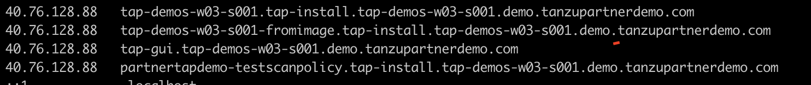

###### Delete the accelerator 

```execute
tanzu accelerator delete {{ session_namespace }}
```

###### List the workloads

```execute
tanzu apps workload list -n tap-workload
```

###### Delete the workload {{ session_namespace }}

```execute
tanzu apps workload delete {{ session_namespace }} -n tap-workload -y
```

###### Delete the workload {{ session_namespace }}-fromimage

```execute
tanzu apps workload delete {{ session_namespace }}-fromimage -n tap-workload -y
```

###### Delete the workload partnertapdemo-testscanpolicy

```execute
tanzu apps workload delete partnertapdemo-testscanpolicy -n tap-workload -y
```

###### List the workloads

```execute
tanzu apps workload list -n tap-workload
```

###### Clear the DNS entries created in previous sections: 

-   {{ session_namespace }}.tap-workload.{{ session_namespace }}.demo.tanzupartnerdemo.com
-   {{ session_namespace }}-fromimage.tap-workload.{{ session_namespace }}.demo.tanzupartnerdemo.com
-   tap-gui.{{ session_namespace }}.demo.tanzupartnerdemo.com
-   partnertapdemo-testscanpolicy.tap-workload.{{ session_namespace }}.demo.tanzupartnerdemo.com


