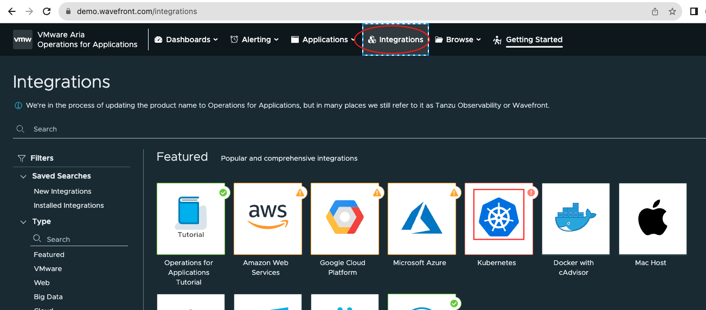
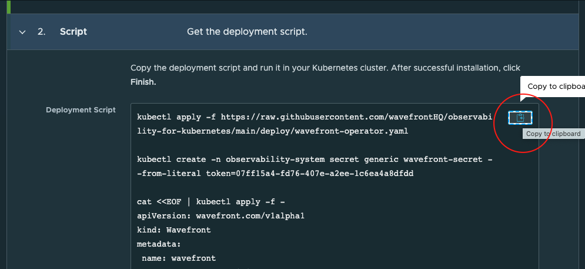
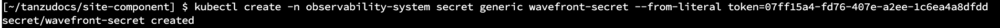
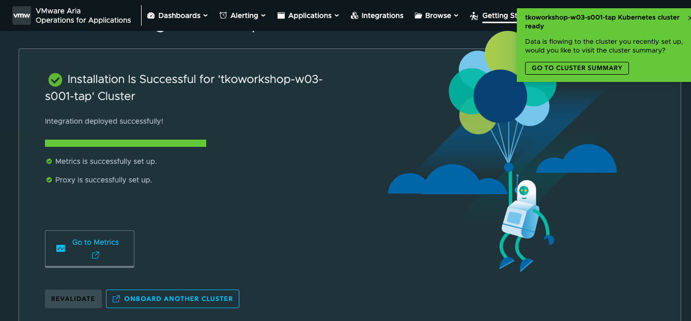
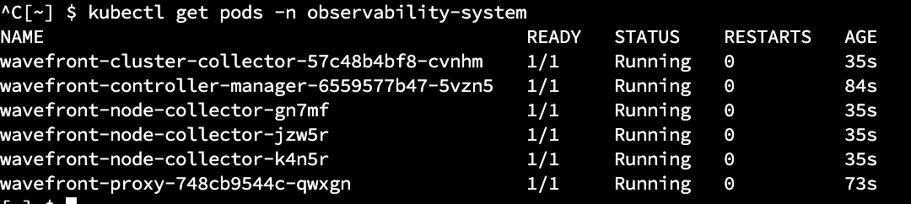
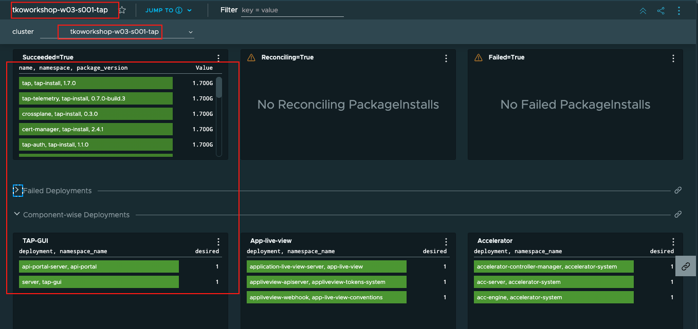

Install the Aria Operations for Applications dashboard for Tanzu Application Platform (beta)

###### Prerequisites: 

* Before integrating a Kubernetes cluster with AOA you must have:

    * AOA Wavefront access with permissions to integrate Kubernetes clusters and view dashboards
    * A Kubernetes cluster with Tanzu Application Platform installed
 
###### To integrate with AOA:

* Log in to your AOA instance, click the **INTEGRATIONS** tab, and then click **Kubernetes**.

```dashboard:open-url
url: https://demo.wavefront.com/
```


 
Click **ADD AN INTEGRATION INSTANCE** on the next page.

* Fill out the Kubernetes Integration Setup page:

    * Select Kubernetes Cluster as the distribution type.
    * Type the cluster name: **{{ session_namespace }}-tap**
    * Enable Metrics.
    * Configure authentication. If the token is not listed, verify that you have AOA Wavefront access.
    * Run the kubectl commands in the Deployment Script text box on the cluster that you want to onboard.
      



    
   * Click **Finish**
      
 

<p style="color:blue"><strong> Verify the pods in observability-system namespace </strong></p>

```execute-2
kubectl get pods -n observability-system
```



* Click on Metrics to see the cluster dashoard 

###### Set up metrics collection in a cluster

* Apply the included tap-metrics.yaml file to the onboarded cluster, which enables the collection of Tanzu Application Platform **CustomResource** metrics, by running:

```execute-1
kubectl apply -f $HOME/tap-metrics.yaml
```

##### Create the dashboard in AOA Wavefront

* Go to the AOA Wavefront home page and then click **Dashboards** > **Create Dashboard**.

* Provide Name: **{{ session_namespace }}-tap**

* Click JSON in the upper right corner

```editor:open-file
file: ~/tap-health-dashboard.json
```

* Click Tree > Code and Copy the content from tap-health-dashboard.json into the code block and then click ACCEPT.

* Click SAVE in the top right corner to save the dashboard.

* Select the cluster **{{ session_namespace }}-tap** from dropdown that you onboarded



**Note:** Wait for few mins to view all the metrics showing in dashboard. 
