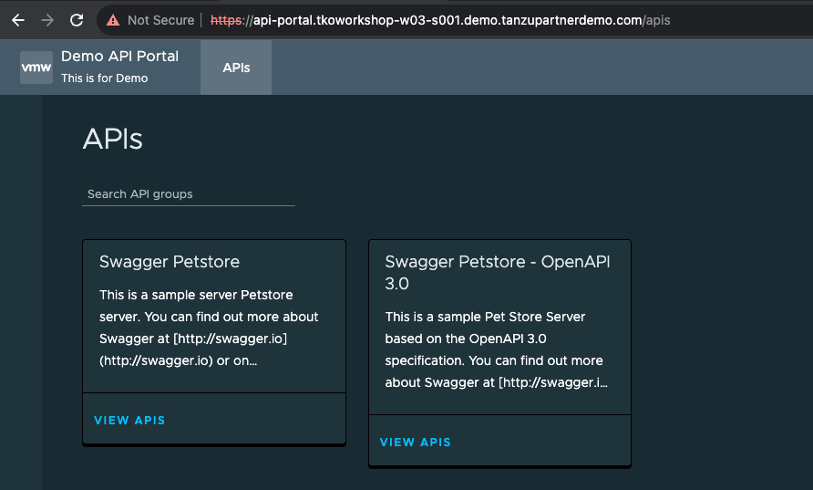

You can view detailed API documentation and try out an API to meet your needs. API portal assembles its dashboard and detailed API documentation views by ingesting OpenAPI documentation from the source URLs. An API portal operator can add any number of OpenAPI source URLs in a single instance.

* API portal for VMware Tanzu supports:

    * Authentication through Single Sign-On (SSO)
    * API keys configuration and management
    * Secure communication by using TLS

```execute-1
tanzu package installed get api-portal -n tap-install
```

```dashboard:open-url
url: http://api-portal.{{ session_namespace }}.demo.tanzupartnerdemo.com/apis
```



```dashboard:open-url
url: https://docs.vmware.com/en/API-portal-for-VMware-Tanzu/1.4/api-portal/GUID-configuring-k8s-basics.html
```

```dashboard:open-url
url: https://docs.vmware.com/en/API-portal-for-VMware-Tanzu/1.4/api-portal/GUID-api-viewer.html
```

Many API management solutions available today are based on a centralized design, whereby a central IT team manages API visibility. This creates burdens for those teams, such as having to update API routes on behalf of application development teams and apply complex centrally managed security policies.

In contrast to this centralized approach, API portal can be deployed in a distributed model designed to support scale and self-service:

  * Individual teams can deploy their own API portal as they evolve their APIs and associated documentation

  * Operators can configure any number of API portal instances in various environments (e.g., dev, test, prod) and provide access to specified groups—such as lines of businesses—based on how groups are organized

  * Operators can easily set up API portal with Single Sign-On through their OpenID Connect provider of choice

Alongside Spring Cloud Gateway for Kubernetes and Spring Cloud Gateway for VMware Tanzu, API portal provides baseline management capabilities for an internal API sharing economy across an organization's teams and lines of business.
