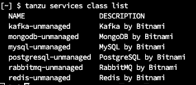

Bitnami Services provides a set of backing services for Tanzu Application Platform (commonly known as TAP). The services are MySQL, PostgreSQL, RabbitMQ, Redis, MongoDB, and Kafka all of which are backed by the corresponding Bitnami Helm Chart.

Through integration with Crossplane and Services Toolkit, these six services are immediately ready for apps teams to consume, with no additional setup or configuration required from ops teams. This makes it incredibly quick and easy to get started working with services on Tanzu Application Platform.

<p style="color:blue"><strong> Refer Documentation </strong></p>

```dashboard:open-url
url: https://docs.vmware.com/en/VMware-Tanzu-Application-Platform/1.7/tap/bitnami-services-about.html
```

<p style="color:blue"><strong> You can discover the range of services by running: </strong></p>

```execute
tanzu service class list
```



<p style="color:blue"><strong> You can learn and discover more about a class by running: </strong></p>

```execute
tanzu service class get postgresql-unmanaged
```

<p style="color:blue"><strong> Create a namespace </strong></p>

```execute
kubectl create namespace dev-team-1
```

<p style="color:blue"><strong> Create a claim for the postgresql-unmanaged class </strong></p>

```execute
tanzu service class-claim create psql-1 --class postgresql-unmanaged --parameter storageGB=3 -n dev-team-1
```

<p style="color:blue"><strong> Confirm the status of the claim </strong></p>

```execute
tanzu service class-claim get psql-1 --namespace dev-team-1
```

<p style="color:blue"><strong> After creating the claim, you can bind it to one or more of your application workloads </strong></p>

```execute
#tanzu apps workload create my-workload --image my-registry/my-app-image --service-ref db=services.apps.tanzu.vmware.com/v1alpha1:ClassClaim:psql-1
```

You must pass the claim reference with a corresponding name that follows the format --service-ref db=services.apps.tanzu.vmware.com/v1alpha1:ClassClaim:psql-1. The db= prefix to this example reference is an arbitrary name for the reference.
