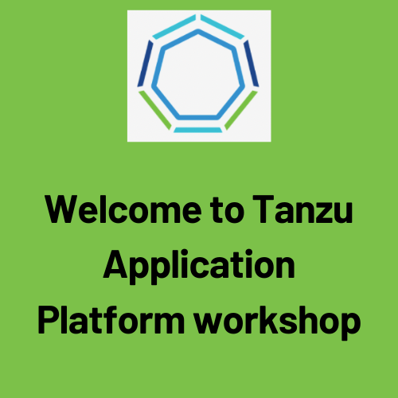

###### This workshop helps you to get some good understanding on below topics: 

1. Prepare TAP values file
2. Complete the pre reqs for installing TAP packages
3. Install TAP with full profile
4. Create a workload
5. Explore App Live view, Supply chain and TAP GUI
6. Create Accelerators
7. Metadata store (SBOM)
8. Explore Tech Docs and API Docs
9. Security Analysis
10. Vulnerability Scanning
11. API Portal
12. Supply Chain
13. Aria Operations for Apps
14. Authentication
15. Bitnami Services

###### For more info, refer to VMware official documentation on TAP 1.7: 

```dashboard:open-url
url: https://docs.vmware.com/en/VMware-Tanzu-Application-Platform/1.7/tap/overview.html
```

###### Short Video on TAP: 

```dashboard:open-url
url: https://www.youtube.com/watch?v=H6rbIkaJ1xc
```

<p style="color:blue"><strong> Easy path to production using VMware Tanzu Application Platform </strong></p>

```dashboard:open-url
url: https://www.youtube.com/watch?v=dbWSPQ9tTEk
```

<p style="color:blue"><strong> Improve Developer Experience using Tanzu Application Platform </strong></p>

```dashboard:open-url
url: https://www.youtube.com/watch?v=3p9lNSn8DSc
```

<p style="color:blue"><strong> Securing end to end Kubernetes application supply chain using Tanzu </strong></p>

```dashboard:open-url
url: https://www.youtube.com/watch?v=V5voRJJ6qTs
```
